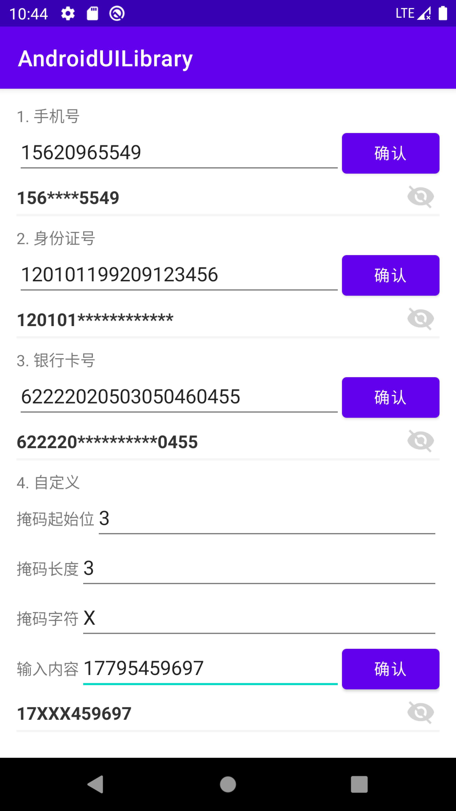
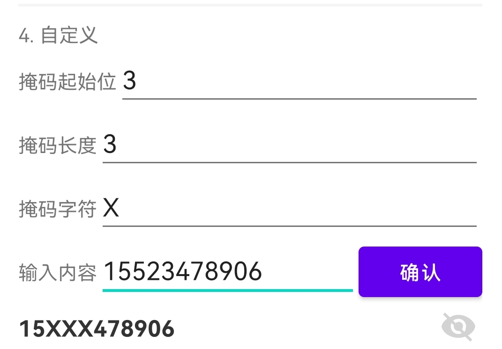

### [README of Chinese](obfuscated_text_view_CN.md)

# ObfuscatedTextView


## About

This a View that can be switched between plain text and obfuscated text.Different display templates can be customized according to different display content formats.You can set the start position, end position and mask character by yourself.

[中文](./obfuscated_text_view_CN.md)

## Effect Picture



## Download the demo

#### [Click me to Download the demo](./output/demo.apk)

#### [Click me to Download the aar file](./output/ObfuscatedEditText.aar)

## Release notes

## Documentation

### 1.Basic usage

This function is mainly implemented on the TransformationMethod interface, so you only need to create it through the builder and set it to your textview or editview to use this function.

```kotlin
//example:
var method  = ObfuscatedTransformationMethodBuilder(start, lenght)
                    .obfuscatedPatternCharacter(char).build()
textView.transformationMethod = method
```

Set the start index and length that need to be obfuscated. And you can also set characters as obfuscation marks, such as "&" or "#". If not set, "\*" will be used by default.



At the same time, we also provide a widget with a switch, which can switch between the text after the masked and the original text.Add it in the layout file and set the TransformationMethod.

```xml
//example:
   <com.adastragrp.mobile.common.ui.view.ObfuscatedEditLayout
         android:layout_width="match_parent"
         android:layout_height="wrap_content"
         app:obfuscateIcon="@drawable/xxxxxxx"
/>
```

You can set your custom valid logic and error tip logic to the widget:

```java
binding.viewCustomObfuscate.setValidationStrategy(object : ValidationStrategy {
            override fun validate(s: String): Boolean {
                return s.matches(Regex("^1([3456789])[0-9]{9}"))
            }

            override fun onTextFormatError(errorString: String): String {
                Toast.makeText(applicationContext, "format error", Toast.LENGTH_SHORT).show()
                return ""
            }

        })
```

### 2.Description of various difficult problems and their solutions

Beware that the returned text must be exactly the same length as the source text.And if you have performed some text formatting operations on the string (such as adding separators), please adjust the obfuscation start position and obfuscation end position.

## License

ObfuscatedTextView is available under the Apache 2.0 license. See the LICENSE file for more info.
