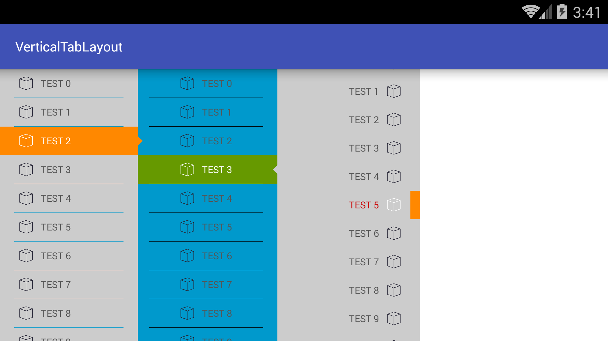

# Vertical Tab Layout


## About

Vertical Tab Layout for Android

[中文](./vertical_tab_layout_CN.md)

## Download

[Demo](screenshot/vertical-tab-layout.mp4)

[Click me to download the aar file](./output/VerticalTabLayout.aar)

## Documentation
---

### How to use:

```xml

<com.hcxc.verticaltablayout.VerticalTabLayout 
    android:id="@+id/tab_layout_2"
    android:layout_width="150dp" 
    android:layout_height="match_parent"
    android:layout_marginLeft="142dp" 
    android:background="@android:color/holo_blue_dark"
    app:vDividerColor="@android:color/black" 
    app:vDividerHeight="1px" 
    app:vDividerPadding="15dp"
    app:vTabArrowColor="#cccccc" 
    app:vTabHeight="30dp" 
    app:vTabIconPadding="8dp"
    app:vTabIndicatorColor="@android:color/holo_green_dark" 
    app:vTabIndicatorGravity="fill"
    app:vTabSelectedTextColor="@android:color/white" 
    app:vTabTextColor="#555555"
    app:vTabTextSize="10dp" 
    app:vTabViewGravity="center" />
```

```java
VerticalTabLayout vTabLayout=(VerticalTabLayout)findViewById(R.id.tab_layout);
vTabLayout.addTab(vTabLayout.newTab().setText("TEST").setIcon(R.drawable.ic_selector));
vTabLayout.setOnTabSelectedListener(new VerticalTabLayout.OnTabSelectedAdapter(){
        @Override
        public void onTabSelected(VerticalTabLayout.Tab tab,int position){
                Toast.makeText(getApplicationContext(),"onTabSelected: "+position,ToastLENGTH_SHORT).show();
        }
});
```
